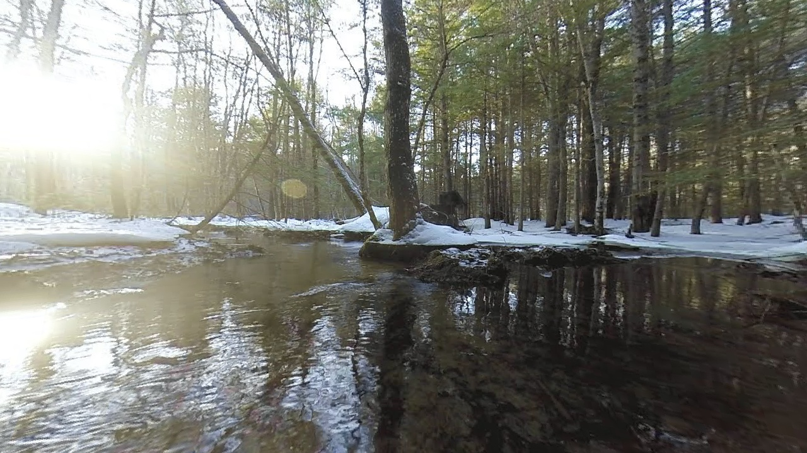

# Interactive Distortion Corrector

Those of you who have used GoPros or other small form factor cameras know the pain of having to open a software (like GoPro Studio) everytime you want to undistort your videos


Even more painful is the fact that even if you slightly modify the video before you feed it into GoPro Studio, the software rejects the file, because it checks the MetaData

So here is a simple solution to correct the distortion by code. For your FOV, SuperView/NonSuperView, etc, you have to find the correct parameters using `interactive-distortion-corrector.cpp`


Once that is done, you can simply feed it into `distCorrect2.cpp` and it will undistort the video for you


## Parameters that you can play around with
* k1,k2: The coefficients of the Brownian model distortion correction
* Black Border Factor: An addition of a black border so that you have more of your original image in your undistorted picture

## Running the code
OpenCV is the only prerequisite for running this program. I highly recommend also installing ffmpeg to convert the videos generated by `distCorrect2.cpp` once they are made

```bash
# This line compiles your file. The compiled binary provided in the repository will work if you are using gcc 5.4
g++ `pkg-config --cflags opencv` interactive-distortion-corrector.cpp -o interactiveOne `pkg-config --libs opencv`
# This line runs the file. You can give either a picture or a video as the argument. For now, let us assume the picture we are undistorting is maxresdefault
./interactiveOne maxresdefault.jpg
```